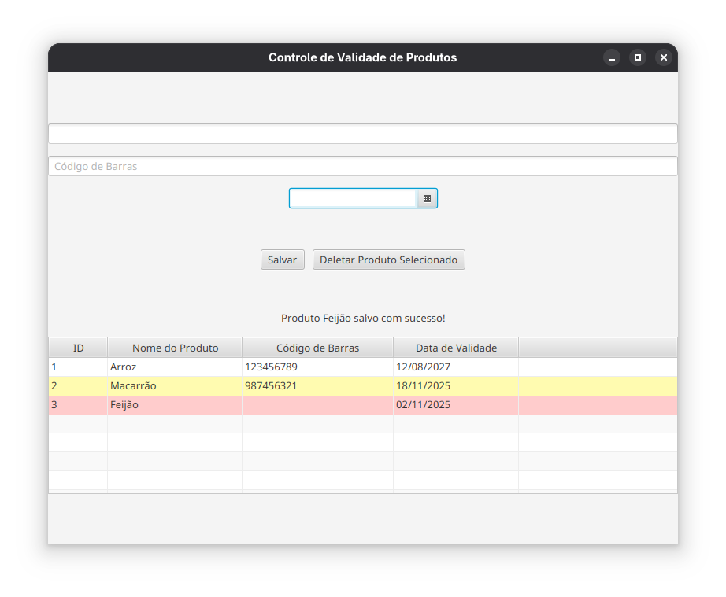

# 📦 Controle de Validade de Produtos

Um aplicativo de desktop simples, mas poderoso, para gestão de produtos e controlo de datas de validade. Este projeto foi desenvolvido como uma ferramenta prática para ajudar pequenos negócios familiares a monitorizar o seu inventário e prevenir perdas por vencimento.

---

## 🎯 Objetivo

O objetivo inicial deste projeto foi criar uma solução desktop para ajudar os meus pais a gerir os produtos do seu pequeno comércio, focando-se em alertar visualmente sobre produtos vencidos ou próximos do vencimento.

---

## ✨ Funcionalidades (Versão Atual)

Atualmente, a aplicação suporta as seguintes operações de CRUD (Criar, Ler, Deletar):
* **Criar:** Adicionar novos produtos ao inventário, incluindo nome, código de barras e data de validade.
* **Ler:** Exibir todos os produtos guardados numa tabela clara e organizada assim que a aplicação inicia.
* **Deletar:** Selecionar e remover produtos do inventário com um único clique.
* **Destaque Visual (Controlo de Validade):** A tabela utiliza cores para alertar automaticamente o utilizador:
    * **Vermelho:** Produtos que já estão vencidos.
    * **Amarelo:** Produtos que estão perto de vencer (dentro de 7 dias).

---

## 🛠️ Tecnologias Utilizadas

Este projeto foi construído utilizando um *stack* 100% Java, demonstrando competências em desenvolvimento full-stack de desktop:

* **Front-End (Interface):** [JavaFX](https://openjfx.io/) e FXML (com Scene Builder)
* **Back-End (Lógica):** Java 21+
* **Base de Dados (Persistência):** [SQLite](https://www.sqlite.org/index.html) (para um banco de dados local, leve e embutido)
* **Gestão de Dependências/Build:** [Apache Maven](https://maven.apache.org/)
* **Padrão de Projeto:** A arquitetura do código foi organizada usando o padrão **DAO (Data Access Object)** para separar a lógica de negócio das regras de acesso à base de dados.

---

## 🚀 Como Executar o Projeto

Para executar este projeto localmente, você precisará ter o [JDK (Java Development Kit)](https://www.oracle.com/java/technologies/downloads/) (versão 21 ou superior) e o [Apache Maven](https://maven.apache.org/download.cgi) instalados.

1.  **Clone o repositório:**
    ```bash
    git clone [https://github.com/SEU-USUARIO/SEU-REPOSITORIO.git](https://github.com/SEU-USUARIO/SEU-REPOSITORIO.git)
    cd SEU-REPOSITORIO
    ```

2.  **Limpe e Instale as Dependências:**
    (Isto irá "limpar" builds antigos e descarregar todas as bibliotecas necessárias, como JavaFX e SQLite)
    ```bash
    mvn clean install
    ```

3.  **Execute a Aplicação:**
    (Este comando utiliza o plugin do JavaFX que configurámos no `pom.xml` para iniciar a aplicação corretamente)
    ```bash
    mvn javafx:run
    ```

---

## 📸 Screenshots

### Tela Principal e Destaque de Validade


---

## 🔜 Próximos Passos (Em Desenvolvimento)

O *roadmap* para este projeto inclui:
* Implementar a funcionalidade de **Editar (Update)** os produtos existentes.
* Adicionar um campo de "Quantidade".
* Criar uma tela de *splash screen* ou *login*.
